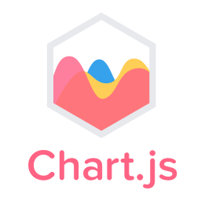

    

<h1 align="center">👋 It's hasan</h1>
<h3 align="center">A Web Dev From Pakistan</h3>

&nbsp;

<h4 align='center'>I’m currently working on</h4>

<a href="https://www.coursera.org/professional-certificates/meta-front-end-developer">🏆Completing Meta Certification</a>

🔥 bettering myself in the MERN STACK

📫 Have a meeting with me on <a href="https://calendly.com/hasanrizwan/meeting-with-hasan-rizwan-dev">Calendly</a> | hasanrizwan6@gmail.com

💬 Ask me about the MERN Stack and the reason why you and I exist.

 
<h2 align="center">My Work</h2>

    <table>
        <tr>
            <td width="50%">
                <!-- Project-1 -->
                <h3 align="center" color="white">Text Utility</h3>
                

                    <!-- Video -->
                    
                    https://user-images.githubusercontent.com/64814635/179623328-e867c3fc-f9f5-4972-b105-920a1ad203e1.mp4
                     
                     
                    

                        <!-- Code Button -->
                        
                        <!-- Website Button -->
                        
                    

                    <!-- Description -->
                    

                        <strong>React</strong> - An application that can manipulate your text in different ways, has a word and character counter. In addition to that, it has dark mode as well
                    

                

                <!-- Project-2 -->
                <h3 align="center" color="white">Nike Clone</h3>
                

                    <!-- Video -->
                    
                    https://user-images.githubusercontent.com/64814635/179627275-924f632f-c2d6-4f95-b9dd-b704d2dbb740.mp4
                     
                     
                    

                        <!-- Code Button -->
                        
                        <!-- Website Button -->
                        
                    

                    <!-- Description -->
                    

                        <strong>React</strong> - A nike clone to implement react router. It navigates you through a collection of shoes and shows the details when navigated
                    

                

            </td>
             
            <td width="50%">
                <!-- Project-3 -->
                <h3 align="center" color="white">Quiz App</h3>
                

                    <!-- Video -->
                    
                    https://github.com/hasan-rizwan/hasan-rizwan/assets/64814635/0d28c7e8-2c6a-42bc-a849-1e1102f95934
                     
                     
                    

                        <!-- Code Button -->
                        
                        <!-- Website Button -->
                        
                    

                    <!-- Description -->
                    

                        <strong>React</strong> - In this tracker, there's a detailed chart that shows the amount of people that got infected, recovered and died globally or country specific.
                    

                

                <!-- Project-4 -->
                <h3 align="center" color="white">Calculator</h3>
                

                    <!-- Video -->
                    
                    https://user-images.githubusercontent.com/64814635/179628034-0ff3d229-75f4-4256-ab2d-b4c12fe8dfc9.mp4
                     
                     
                    

                        <!-- Code Button -->
                        
                        <!-- Website Button -->
                        
                    

                    <!-- Description -->
                    

                        <strong>React</strong> - A fancy-looking calculator that can perform all the basic operations.
                    

                     
                     
                

            </td>
        </tr>
    </table>
     
    <!-- Social Media Icons -->
    <h2 align="center">Connect with me:</h2>
    

        
        
        
        
    

    <!-- Langs & Tools Icons -->
    <h2 align="center">Languages and Tools:</h2>
    

        
        
        
        
        
        
        
        
        
        
        
        
        
        
        
        
        
        
    

    <!-- Github Stats -->
    <h2>🏆 Github Stats</h2>
    

        
        
    

    

        **Visitors Count**
        
    

